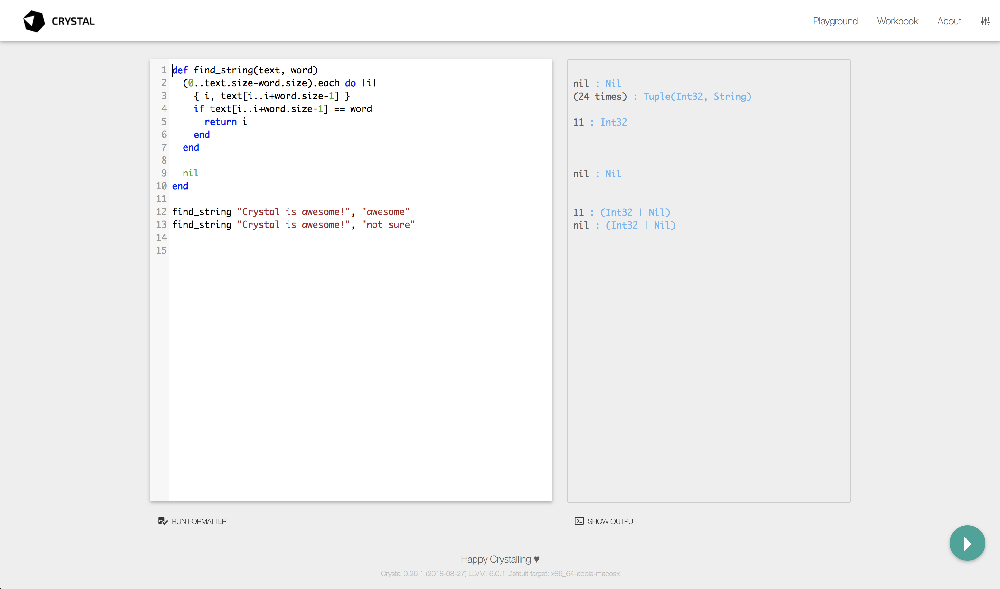

= Getting Started

著者: 5t111111

// tag::body[]

「はじめに」の章で説明したように、 Crystal はコンパイラ言語なので、プログラムのソースコードをコンパイルするためのコンパイラが必要になります。

この章ではまず、 Crystal を実際に使っていくための様々なプラットフォームでのインストール方法を紹介します。

そして、プログラムを書くために大事なエディタのサポート状況や、 Web ブラウザ上で Crystal プログラムを実行することのできる Playground というツールについても紹介します。

== Crystal のインストール

Crystal のインストール方法は OS ごとに異なります。ここでは、主要な Linux ディストリビューションや macOS 、そして Windows へのインストール方法を紹介します。

=== Debian や Ubuntu

Debian 系のディストリビューションでは、 Crystal の公式リポジトリを利用できます。

そのために、まず APT の構成にリポジトリを追加します。以下のコマンドを実行してください。

[source,console]
----
$ curl -sSL https://dist.crystal-lang.org/apt/setup.sh | sudo bash
----

これによりリポジトリが構成されキーが登録されます。もし上記を自分自身で設定するのがお好みの場合は、以下を実行しても同じことができます。

[source,console]
----
$ curl -sL "https://keybase.io/crystal/pgp_keys.asc" | sudo apt-key add -
$ echo "deb https://dist.crystal-lang.org/apt crystal main" | sudo tee /etc/apt/sources.list.d/crystal.list
$ sudo apt-get update
----

リポジトリを構成したら以下で Crystal がインストールできます。

[source,console]
----
$ sudo apt install crystal
----

以下に記載するパッケージは必須ではありませんが、標準ライブラリの機能を使う上で必要となるためインストールすることを推奨します。

[source,console]
----
$ sudo apt install libssl-dev      # OpenSSL に必要です
$ sudo apt install libxml2-dev     # XML に必要です
$ sudo apt install libyaml-dev     # YAML に必要です
$ sudo apt install libgmp-dev      # Big numbers に必要です
$ sudo apt install libreadline-dev # Readline に必要です
----

なお、新しいバージョンの Crystal がリリースされた場合は以下でアップグレードできます。

[source,console]
----
$ sudo apt update
$ sudo apt install crystal
----

=== Red Hat や CentOS

Red Hat 系のディストリビューションでも、 Crystal の公式リポジトリを利用できます。

まず YUM の構成にリポジトリを追加します。以下のコマンドを実行してください。

[source,console]
----
$ curl https://dist.crystal-lang.org/rpm/setup.sh | sudo bash
----

これでリポジトリが構成されキーが登録されますが、以下のように、同様のことを手動で行うことも可能です。

[source,console]
----
$ rpm --import https://dist.crystal-lang.org/rpm/RPM-GPG-KEY

$ cat > /etc/yum.repos.d/crystal.repo <<END
$ [crystal]
$ name = Crystal
$ baseurl = https://dist.crystal-lang.org/rpm/
$ END
----

リポジトリを構成したら以下で Crystal がインストールできます。

[source,console]
----
$ sudo yum install crystal
----

なお、新しいバージョンの Crystal がリリースされた場合は以下でアップグレードできます。

[source,console]
----
$ sudo yum update crystal
----

=== Arch Linux

Arch Linux では、ユーザリポジトリから Crystal をインストールできます。パッケージの依存関係を管理するための `shards` も必要になるので同様にインストールしてください。

[source,console]
----
$ sudo pacman -S crystal shards
----

=== Gentoo Linux

Gentoo Linux では、メインの overlay に Crystal が含まれています。

以下で構成のフラグを確認できます。

[source,console]
----
# equery u dev-lang/crystal
[ Legend : U - final flag setting for installation]
[        : I - package is installed with flag     ]
[ Colors : set, unset                             ]
 * Found these USE flags for dev-lang/crystal-0.18.7:
 U I
 - - doc      : Add extra documentation (API, Javadoc, etc). It is recommended to enable per package instead of globally
 - - examples : Install examples, usually source code
 + + xml      : Use the dev-libs/libxml2 library to enable Crystal xml module
 + - yaml     : Use the dev-libs/libyaml library to enable Crystal yaml module
----

以下を実行してインストールしてください。

[source,console]
----
$ su -
# emerge -a dev-lang/crystal
----

=== macOS

macOS では、 http://brew.sh/[Homebrew] を利用して簡単に Crystal をインストールできます。

[source,console]
----
$ brew update
$ brew install crystal
----

なお、macOS で Crystal を使うときに以下のエラーに遭遇することがあります。

[source,console]
----
ld: library not found for -levent
----

その場合は、以下のようにコマンドラインツールを再インストールした上で、デフォルトのツールチェインを選択し直す必要があります。

[source,console]
----
$ xcode-select --install
$ xcode-select --switch /Library/Developer/CommandLineTools
----

=== Linuxbrew

http://linuxbrew.sh/[Linuxbrew] を使って Linux に Crystal をインストールすることもできます。

[source,console]
----
$ brew update
$ brew install crystal-lang
----

もし Crystal の言語自体を開発することにも興味があるのであれば、同時に LLVM もインストールしておくと良いでしょう。その場合は上記の2行目を以下に変更します。

[source,console]
----
$ brew install crystal-lang --with-llvm
----

=== Windows

残念ながら、まだ Crystal は Windows での実行をサポートしていません。ですが、 https://docs.microsoft.com/en-us/windows/wsl/about[Windows Subsystem for Linux] を利用することで Windows 10 上で Crystal を使うことが可能です。

WSL 上での Crystal のインストール方法は、それぞれの Linux ディストリビューションにおけるインストール方法と同様です。例えば、もし WSL に Ubuntu を導入したのであれば、前掲の「 Debian や Ubuntu 」でのインストール方法を参照してください。

=== その他のインストール方法

ここまで、プラットフォームごとのインストール方法を説明しましたが、自分の使っている環境が対応していない場合や、より最新のバージョンを使いたい場合のインストール方法を紹介します。入門書の範囲を超えてしまうため、詳細についてはリンク先をご覧ください。

- https://crystal-lang.org/docs/installation/from_a_targz.html[tar ボールからのバイナリインストール]
- https://crystal-lang.org/docs/installation/from_source_repository.html[ソースコードからのビルド]

== Hello Crystal

=== インストールの確認

Crystal のインストールができたら、以下のコマンドを実行してみましょう。これで、Crystal がインストールされて利用できる状態かどうかが確認できます。

[source,console]
----
$ crystal -v
----

正常にインストールされている場合、

[source,console]
----
Crystal 0.27.2 (2019-02-05)

LLVM: 6.0.1
Default target: x86_64-apple-macosx
----

といったバージョン情報が表示されます。もし「コマンドが見つからない」といったエラーが表示された場合は、

- Crystal のインストールでエラーが発生していないか
- Crystal をインストールした場所にパスが通っているか

を確認してください。

=== はじめての Crystal プログラム

無事にインストールして使える状態になっていたら、はじめての Crystal のプログラムを書いてみましょう。ご多分に漏れず、ここでも最初のプログラムは「 Hello world 」とします。

好きなエディタで、以下のプログラムを書いて `hello.cr` として保存してください。Crystal の拡張子は `.cr` です。

[source,crystal]
.hello.cr
----
puts "Hello world!"
----

それではプログラムを実行してみましょう。

[source,console]
----
$ crystal hello.cr
----

実行して、

[source,console]
----
Hello world!
----

と表示されたら成功です！

Crystal はコンパイラ言語ですが、このように1つのコマンドでコンパイルと実行を同時に行うことができます。

[source,console]
----
$ crystal run hello.cr
----

と実行しても同様です。

== Crystal を書くためのエディタ

さて、これで Crystal を書くための準備が整ったので、次の章からは文法など実際にプログラムを書くための内容に入っていきます。ですが、プログラムを快適に書くためにはエディタのサポートも欠かせません。

この章では最後に、以下の代表的なオープンソースエディタの Crystal サポートの状況について簡単に紹介します。

- Visual Studio Code
- Atom
- Vim
- Emacs

=== Visual Studio Code

Visual Studio Code、通称 VSCode は機能の豊富さとシンプルさ軽さを両立したエディタとしてとても人気のエディタです。

VSCode で Crystal プログラミングをサポートするエクステンションにはいくつか種類がありますが、現在最も活発に開発されているのは Crystal Language というものです。GitHub 上では https://github.com/crystal-lang-tools/vscode-crystal-lang[crystal-lang-tools/vscode-crystal-lang] というリポジトリで開発されています。

この Crystal Language エクステンションをインストールするだけで、

- シンタックスハイライト
- 自動インデント
- 自動フォーマット
- エラー検知
- 定義ジャンプ

などの機能がすぐに利用できるようになります。

vscode-crystal-lang の GitHub 上の Wiki にはより詳しい設定などの情報も記載されています。例えば、エラーの検知レベルをカスタマイズしたり、

- https://github.com/elbywan/crystalline[Crystalline]
- https://github.com/crystal-lang-tools/scry[Scry]

という Crystal の Language Server との連携などのより便利に使うための設定も書かれていますので併せてご覧ください。

NOTE: Crystalline は Crystal のバージョン `0.35.1` 以降に対応しています。

=== Atom

GitHub 社製のエディタ Atom では、以下のパッケージを導入することで快適に Crystal プログラミングができます。

- https://github.com/crystal-lang-tools/language-crystal[crystal-lang-tools/language-crystal]
- https://github.com/crystal-lang-tools/atom-ide-crystal[crystal-lang-tools/atom-ide-crystal]

language-crystal は Atom のパッケージとしては language-crystal-actual という名前で提供されているので注意が必要です。　これをインストールすると Crystal のシンタックスハイライトや自動インデントがサポートされます。

atom-ide-crystal は、前節でも触れた Language Server と連携して IDE のような機能を追加するものです。まだ機能的には充実していない面もありますが、エラー検知をサポートするなど少しずつ開発が進んでいます。

=== Vim

言わずと知れた Vim でも、プラグインを使うことで Crystal プログラミングにエディタのサポートを受けることができます。

https://github.com/rhysd/vim-crystal[rhysd/vim-crystal] をインストールすると Crystal の filetype が追加され、シンタックスハイライトや自動インデントが有効になります。

また、vim-crystal には Crystal の組み込みツール `crystal tool` や Spec との連携などの便利な機能があり、シームレスにプログラミングしやすくなっています。

エラー検知をしたい場合には、 https://github.com/vim-syntastic/syntastic[vim-syntastic/syntastic] などの統合解析プラグインを導入が必要です。前述の vim-crystal にはこの syntastic 用のチェッカもバンドルされているため、特別な設定をせずとも利用できます。

=== Emacs

Emacs で Crystal のプログラムを書く場合は https://github.com/crystal-lang-tools/emacs-crystal-mode[crystal-lang-tools/emacs-crystal-mode] を使うのがよいでしょう。

このパッケージを導入するとシンタックスハイライトや自動インデントがサポートされ、定番のチェックツール flycheck にも Crystal のサポートが追加されます。

emacs-crystal-mode パッケージは https://melpa.org/#/crystal-mode[MELPA] に登録されているので導入も簡単です。

== Crystal Playground

Crystal Playground を使うと Web ブラウザ上で Crystal のコードを実行できます。

この画像を見るとわかるように、 Playground では、

- 実行結果
- 型情報

などを同時に表示しながら手軽に Crystal プログラミングを楽しむことができます。

Playground は Crystal に同梱されているため、Crystal がインストールされていれば、

[source,console]
----
$ crystal play
----

と実行するだけで Playground サーバが立ち上がり、すぐにアクセスして使うことができます。デフォルトではポート 8080 で起動するので、お気に入りの Web ブラウザで http://localhost:8080 にアクセスしてください。ポートは `-p` オプションでカスタマイズ可能です。

Playground を立ち上げておけば、本書を読み進めるときに、記載されているコードをその場で実行して試したいときにも便利に活用できることでしょう。

== まとめ

この章では、Crystal のインストール方法とエディタのサポート状況、そして Playground について紹介しました。まだ発展途上であり入門書の範囲を超えてしまうのでここでは記載しませんが、 もし Crystal に慣れてきたらエディタと連携したデバッグ方法なども調べてみるとよいでしょう。

次の章では Crystal の構文について説明します。

// end::body[]
